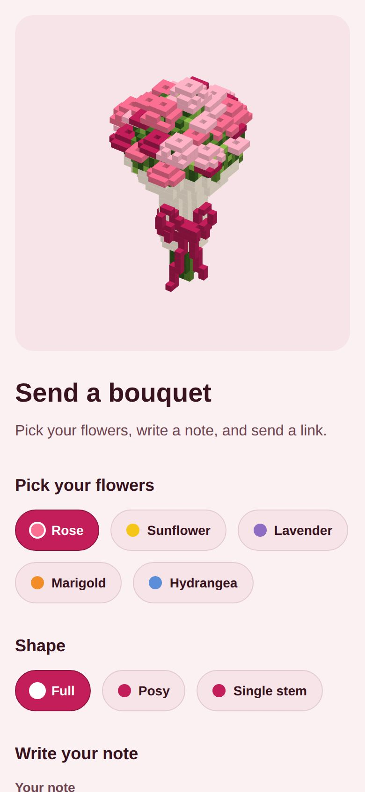
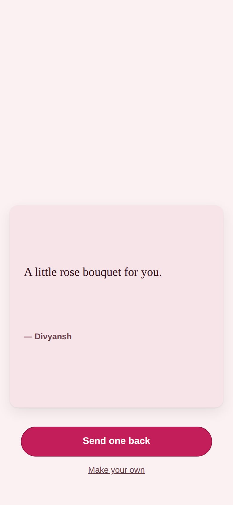
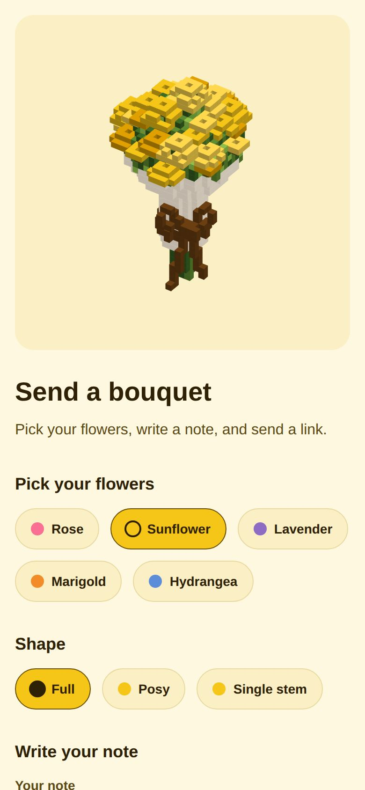
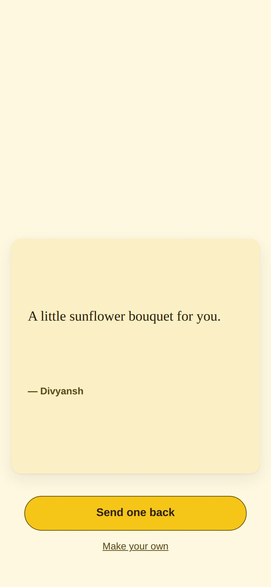
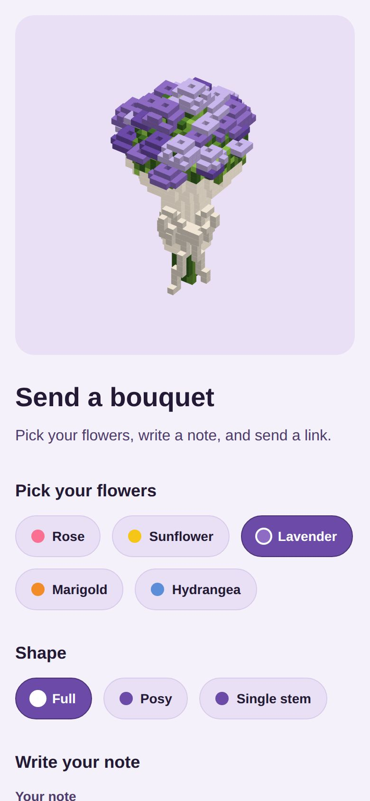
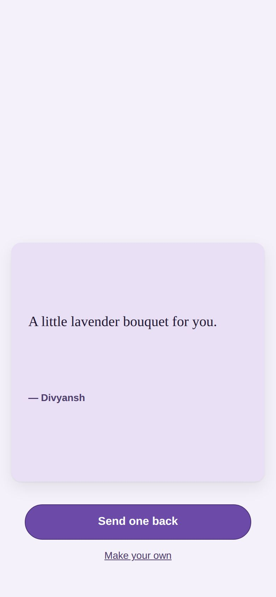
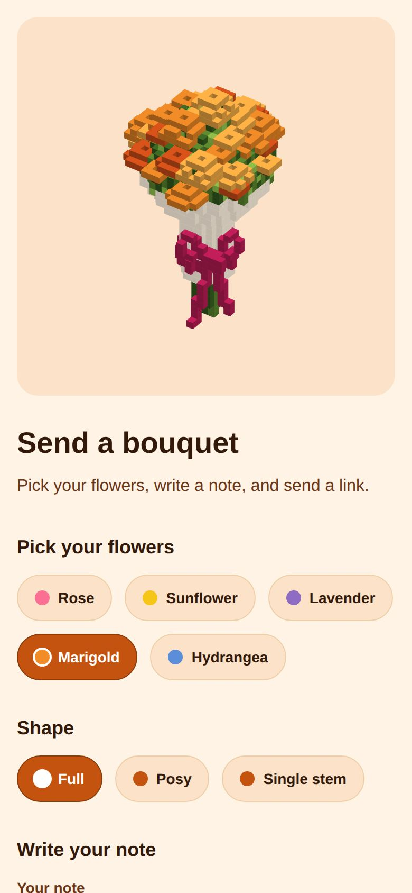
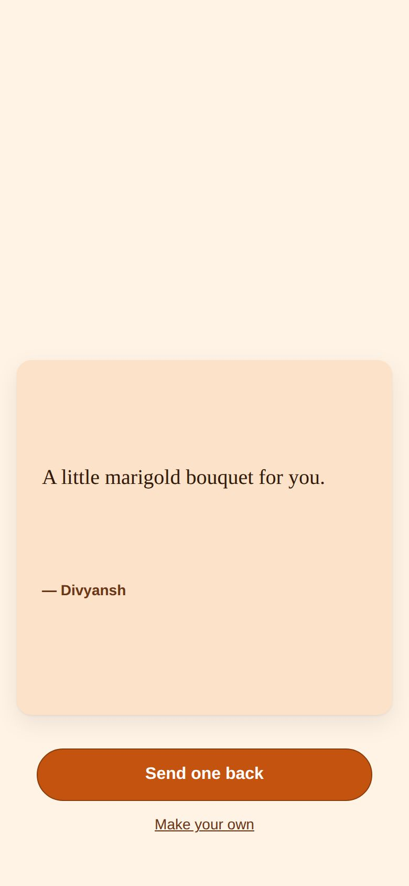
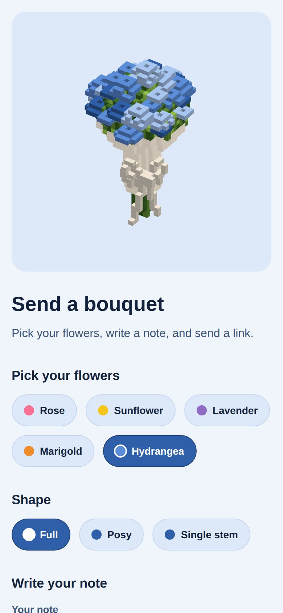
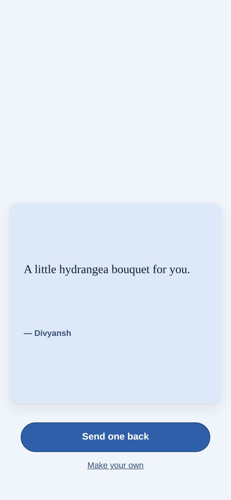

# Bouquet

This folder is the Bouquet product: send someone a voxel bouquet with a
note. The sender picks a flower, writes a note and shares a link; the
recipient opens the bouquet to find the note and sends one back. It lives as
a subfolder of the `Divyansh1401/Portfolio` repo for now, but it is a
separate product, not portfolio content.

## Status

Built and running locally: the renderer core (exact parity with the
portfolio loader), five flower colour themes (one design per flower), and
the full sender page — gifts (photos, links, gift codes, tickets), an
open-on-date countdown, a secret question, and pay-what-you-like for the
paid flowers through a **test checkout** (no real money moves). The
recipient and sent pages handle all of it on a local Node + SQLite server.
Next: the four new flower designs, then a real payment provider. See [`docs/ROADMAP.md`](docs/ROADMAP.md)
for the full order and [`docs/decision-log.md`](docs/decision-log.md) for
what's decided.

## It must never be served by the portfolio site

`apps/` is listed in the repo-root `.vercelignore`. The portfolio
(`index.html`, `mobile.html`, and everything else at the repo root) is a
static site served by Vercel from the repo root — `.vercelignore` keeps this
folder out of every production and preview deployment of that site. Do not
remove or narrow that entry without understanding why it's there.

## Self-contained by design

Nothing under `apps/bouquet` imports or reads files outside `apps/bouquet` at
runtime. The only link to the portfolio's shipping loader
(`assets/js/bouquet-loader.js`) is a vendored, byte-identical reference copy
at `packages/renderer/reference/bouquet-loader.ref.js` (provenance recorded
alongside it) — that copy is read at build/test time, not fetched from the
portfolio at runtime.

This means the folder can be extracted into its own repository later with:

```sh
git subtree split --prefix=apps/bouquet -b bouquet-extract
```

## Run it locally

The whole product runs on your machine with nothing but Node — no
Cloudflare, no Astro, no external services. Data lives in a local SQLite
file.

```sh
cd apps/bouquet
npm install
npm run dev
```

`npm run dev` builds `styles/modes.css` from `packages/modes/modes.js`,
bundles the three client entry points into `app/dist/`, then starts the
server. It prints the URLs to use:

```
bouquet dev server:
  local:  http://localhost:4321/
  LAN:    http://192.168.x.x:4321/
```

Open the `local` URL on your own machine, or the printed `LAN` URL from a
phone on the **same Wi-Fi** to try the real send → open flow on a phone
screen. `PORT` and `HOST` env vars override the defaults if you need to.

Every bouquet you create is stored in `app/.data/bouquet.sqlite` (plus its
`-wal`/`-shm` files), and gift files in `app/.data/uploads/`. That folder is git-ignored — it's your local dev
database, not sample content. **Delete `app/.data/` to reset to a clean
slate**; the server recreates it on next start.

### Running tests

```sh
npm test
```

`npm test` runs `node --test` over every `packages/**/test/**/*.test.mjs`
and `app/test/**/*.test.mjs` file — the renderer/modes/pricing packages and
the server/client app together (including two Chromium suites, `e2e` and
`a11y`, driven by `playwright-core`).

Other scripts:

- `npm run build:css` — regenerate `app/styles/modes.css` from `modes.js`
  (also run automatically by `npm run dev`).
- `npm run build:client` — bundle `app/client/*.page.js` into `app/dist/`
  (also run automatically by `npm run dev`).
- `npm run goldens` — capture renderer golden frames.
- `npm run secrets` — scan tracked/untracked files under `apps/bouquet` for
  forbidden paths (`node_modules/`, `.dev.vars`, `.wrangler/`) and
  secret-shaped strings.
- `npm run size` — check renderer bundle size.

## The 5 flower themes

Picking a mode on the create page (`/`) recolours the whole page — ground,
text, accent, buttons — as well as the bouquet renderer's flower/ribbon
colours. Full token tables are in
[`packages/modes/README.md`](packages/modes/README.md); the headline colours:

| Mode | Petals (deep → light) | Ground | Accent |
|---|---|---|---|
| Rose (default) | `#C41E5A` → `#FFB3C6` | `#FBF1F3` | `#C41E5A` |
| Sunflower | `#E0A000` → `#FFD84D` | `#FFF8E1` | `#F5C518` |
| Lavender | `#6B4AA8` → `#C9B6EC` | `#F5F1FB` | `#6B4AA8` |
| Marigold | `#D9531A` → `#FFB347` | `#FFF3E6` | `#C4530F` |
| Hydrangea | `#2F5FA8` → `#A9C6F0` | `#F0F5FC` | `#2F5FA8` |

See the screenshots below for what each looks like end to end.

## One design per flower

Each flower has a single bouquet design (the Full / Posy / Single stem
picker was removed). Today all five themes use the rose bloom recoloured;
each paid flower gets its own bloom design later (Sunflower, Lavender,
Marigold, and Tulip or Hydrangea).

## Pricing and the test checkout

- **Rose is free for the site's first 100 bouquets** (counted site-wide,
  live bouquets only). After that every bouquet is paid. Set
  `BQ_FREE_LIMIT` to try the "limit reached" state locally, e.g.
  `BQ_FREE_LIMIT=0 npm run dev`.
- **Sunflower, Lavender, Marigold and Hydrangea are paid from day one.**
- **Pay what you like:** ₹30 / ₹50 / ₹100 / ₹150 in India, $2 / $5 / $10 /
  $15 elsewhere (guessed from the time zone, switchable, remembered). Every
  amount unlocks the same thing. One payment = one bouquet.
- Links last **one year** from when the bouquet goes live.
- A paid bouquet is saved as a **draft** first (`202 needs_payment`) and is
  only published once paid. The checkout is a local stand-in with "Pay" and
  "Make it fail" buttons; Razorpay/Stripe replace it later.
- While Rose is free, a paid-flower draft can also be sent as Rose, free.

## The recipient page

`/b/:id` is a port of the owner's birthday page
([`reference/birthday/`](reference/birthday/README.md)): a white gate with an
**open** pill, the 5 s fly-in, then one long scroll. The bouquet holds, then
disperses; the flower's light petal colour swells up as a dome; the note
arrives **one word per scroll**, then "from <name>"; the countdown ("until
<occasion>") runs, and at zero it hands over to a **scratch-foil card** with
the gift under it (tilt on hover, confetti at half scratched). Horizontal
drag or wheel turns the bouquet. The font is TAN Mon Cheri when its licensed
file is installed (see [`app/fonts/README.md`](app/fonts/README.md)), Georgia
otherwise.

What is locked, decided by the server:

- **Quiz** (secret question): sits on the gate. The note and gifts are not in
  the page until it is answered. The answer is stored only as a salted
  scrypt hash; capitals and spaces don't matter; 5 wrong tries lock it for
  10 minutes. Gift files then need a short-lived signed token.
- **Countdown**: locks **only the gifts**. The bouquet and the note are the
  entry point and are always open. The gifts are not sent to the browser
  until the time has passed; the page fetches them when the clock hits zero.

Gifts: up to 8 (up to 6 photos, re-encoded to JPEG in the browser, ≤5 MB),
https links, gift codes, and a ticket/file (PDF or image, ≤10 MB). Uploads
are identified by their bytes, not their name. The first gift is on the
card; "see all N gifts" opens the rest. Drafts and unused uploads older than
a day are swept hourly.

The create page's **Preview** shows this same page in a full-screen frame
(`/preview`, filled over postMessage; nothing is saved), with a "skip
countdown" button.

## Screenshots

Captured with `playwright-core` at a 390×844 phone viewport, one per mode:
the create page (`docs/screens/create-<mode>.jpg`) and a recipient page
after opening (`docs/screens/recipient-<mode>.jpg`). Opening a bouquet
disperses the flower away to reveal the note underneath, so the "revealed"
shots show the note card on that mode's background, not the bouquet itself.

| Mode | Create page | Opened bouquet |
|---|---|---|
| Rose |  |  |
| Sunflower |  |  |
| Lavender |  |  |
| Marigold |  |  |
| Hydrangea |  |  |

## Chromium

Tests and tooling that need a real browser use `playwright-core` (already a
devDependency) pointed at the Chromium binary that's already installed on
this machine:

```js
import { chromium } from 'playwright-core';

const browser = await chromium.launch({
  executablePath: '/opt/pw-browsers/chromium-1194/chrome-linux/chrome',
  args: ['--disable-gpu', '--no-sandbox'],
});
```

**Never run `playwright install` or otherwise download browsers.** The
pinned `executablePath` above is the only Chromium this project uses.
